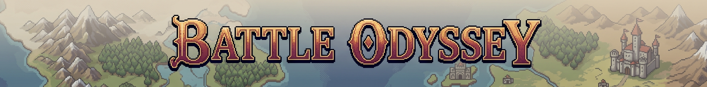
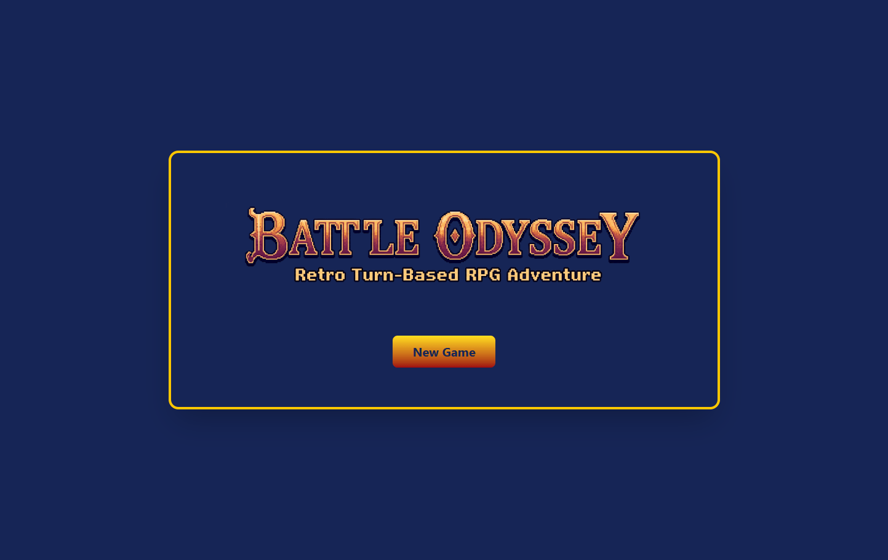
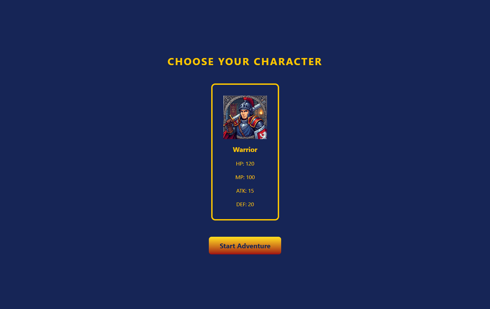
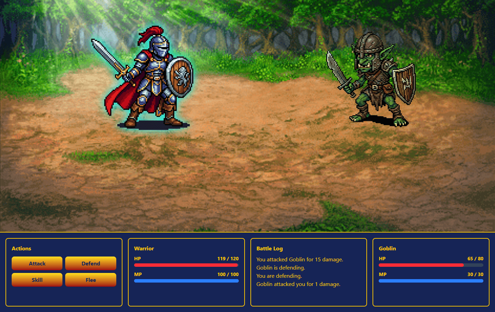

<p align="center">
  
</p>

# Battle Odyssey

## Description

A turn-based RPG built with Laravel and Livewire, inspired by classic 16-bit JRPGs. The player controls a Warrior who faces 3 consecutive battles against increasingly powerful enemies, culminating in a final boss fight. Combat uses four actions: attack, defend, use skills, and flee.

## Preview

<p align="center">
  
  
  
</p>

## Tech stack

- **PHP 8.4**
- **Laravel 13**
- **Livewire 4** 
- **Tailwind CSS** 
- **MySQL**
- **Vite**

## Features

- Character selection screen showing stats before starting
- Turn-based combat system: Attack, Defend, Skill, Flee
- Enemy AI that randomly decides between attacking, defending, or using a skill
- Real-time HP/MP bars powered by reactive Livewire components
- Battle log with the action history
- Progression between battles, with the option to rest (Rest & Next) or continue without resting (Next)
- Character state persisted between battles via session
- Victory, Game Over, and Final Victory screens depending on the outcome

## Architecture

The project follows Laravel's MVC pattern, with Livewire handling the interactive layer without needing traditional controllers for the dynamic views.

The battle screen is split into independent Livewire components, each responsible for its own visual state:

```
Battle (parent component - global combat state)
├── BattleScene          → background and characters on screen
├── BattleActions         → action menu (Attack, Defend, Skill, Flee)
├── BattleCharacterStats  → character HP/MP
├── BattleEnemyStats      → enemy HP/MP
├── BattleLog             → action history
├── BattleVictory         → final victory screen
└── BattleGameOver        → defeat screen
```

Parent-child component communication is handled through Livewire's event system (`dispatch` / `#[On]`), and properties that need real-time updates in child components use the `#[Reactive]` attribute.


## Installation

### Prerequisites

- PHP >= 8.3
- Composer
- Node.js and npm
- MySQL

### Steps

1. Clone the repository:
   ```bash
   git clone https://github.com/M3lgone/battle-odissey.git
   cd battle-odyssey
   ```

2. Install PHP dependencies:
   ```bash
   composer install
   ```

3. Install Node dependencies:
   ```bash
   npm install
   ```

4. Copy the environment file and generate the app key:
   ```bash
   cp .env.example .env
   php artisan key:generate
   ```

5. Configure the database in the `.env` file:
   ```env
   DB_CONNECTION=mysql
   DB_HOST=127.0.0.1
   DB_PORT=3306
   DB_DATABASE=battle_odissey
   DB_USERNAME=root
   DB_PASSWORD=
   ```

6. Run migrations and seeders:
   ```bash
   php artisan migrate --seed
   ```

7. Compile assets:
   ```bash
   npm run dev
   ```

8. Start the server:
   ```bash
   php artisan serve
   ```

9. Open your browser at [http://localhost:8000]

## Game flow

1. **Main menu** → the player clicks "New Game"
2. **Character selection** → the available character's stats are displayed
3. **Battle 1** → turn-based combat against the Goblin
4. **Progression** → after winning, the player chooses to continue with current stats or rest before the next battle
5. **Battle 2** → combat against the Troll
6. **Battle 3 (Boss)** → final combat against the Orc
7. **Final Victory** or **Game Over** depending on the outcome, returning to the main menu

## Author

Project developed by Ismael Gonzalez
